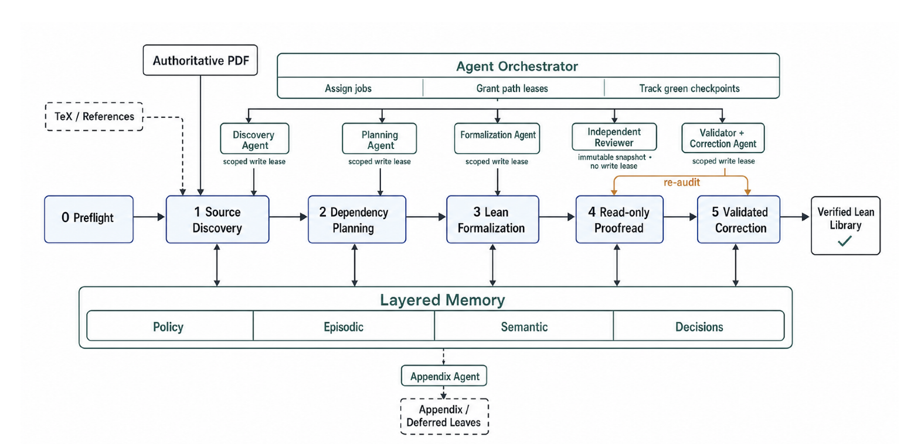

# Lean Learning Theory Formalizations

This repository contains two substantial Lean 4 and Mathlib formalizations in learning theory:

- Joel A. Tropp’s [*An Introduction to Matrix Concentration Inequalities*](https://arxiv.org/abs/1501.01571v1);
- Roman Vershynin’s [*High-Dimensional Probability*](https://www.math.uci.edu/~rvershyn/papers/HDP-book/HDP-2.pdf), second edition.

Together, the libraries develop a reusable formal foundation for concentration inequalities, random vectors, random matrices, matrix analysis, random processes, chaining, dimension reduction, covariance estimation, and sparse recovery.

## Projects

| Project | Mathematical source | Scope | Detailed documentation |
|---|---|---|---|
| MatrixConcentration | Joel A. Tropp, *An Introduction to Matrix Concentration Inequalities*, arXiv:1501.01571v1 | Matrix analysis, the matrix Laplace-transform method, Gaussian and Rademacher series, Chernoff and Bernstein inequalities, intrinsic dimension, applications, and Lieb’s theorem | [`MatrixConcentration/README.md`](MatrixConcentration/README.md) |
| HighDimensionalProbability | Roman Vershynin, *High-Dimensional Probability*, second edition | The Appetizer and nine chapters covering concentration, high-dimensional random vectors and matrices, dependent concentration, quadratic forms, random processes, chaining, and matrix deviation | [`HighDimensionalProbability/README.md`](HighDimensionalProbability/README.md) |

Both project READMEs include chapter-by-chapter Book → Lean correspondence tables that identify the Lean declaration and final module associated with each published source result.

## Repository layout

```text
.
├── MatrixConcentration/
│   ├── Prelude.lean
│   ├── Chapter1_Introduction.lean
│   ├── …
│   ├── Chapter8_ProofOfLiebsTheorem.lean
│   ├── Appendix_*.lean
│   ├── Verification/
│   │   ├── README.md
│   │   └── scripts/
│   └── README.md
├── HighDimensionalProbability/
│   ├── Prelude/
│   ├── Chapter0_Appetizer.lean
│   ├── Chapter1_AnalysisAndProbabilityRefresher.lean
│   ├── …
│   ├── Chapter9_DeviationsOfRandomMatricesOnSets.lean
│   ├── Verification/
│   │   ├── README.md
│   │   └── scripts/
│   └── README.md
├── MatrixConcentration.lean
├── HighDimensionalProbability.lean
├── lakefile.toml
└── lean-toolchain
```

The publication contains the completed consolidated HighDimensionalProbability core modules. The `MatrixConcentration` appendix modules are included because they provide completed formal proofs of external ingredients cited by Tropp.

## Verification records

This repository publishes only the verification scripts and Markdown result
reports for both libraries:

- [HighDimensionalProbability verification](HighDimensionalProbability/Verification/README.md)
- [MatrixConcentration verification](MatrixConcentration/Verification/README.md)

Raw logs and other generated artifacts—including generated tables,
inventories, curation inputs, caches, and transient run state—are intentionally
omitted. Each verification index records the scope and status of the published
audit results.

## Build

The repository is pinned to Lean and Mathlib `v4.31.0`.

Build both libraries from the repository root:

```sh
lake build
```

Build one library:

```sh
lake build MatrixConcentration
lake build HighDimensionalProbability
```

Check an individual module:

```sh
lake env lean MatrixConcentration/Chapter4_MatrixGaussianAndRademacherSeries.lean
lake env lean HighDimensionalProbability/Chapter4_RandomMatrices.lean
```

## Framework Overview



## MatrixConcentration

The Tropp development formalizes:

- Hermitian and rectangular matrix analysis;
- matrix-valued probability and variance statistics;
- the matrix Laplace-transform method;
- Gaussian and Rademacher matrix series;
- matrix Chernoff and Bernstein inequalities;
- intrinsic-dimension refinements;
- covariance estimation and randomized matrix approximation;
- Lieb’s concavity theorem and cited proof ingredients.

Its published correspondence table records 469 kernel-checked declarations associated with the monograph. See the [project README](MatrixConcentration/README.md) for the complete chapter-by-chapter map.

## HighDimensionalProbability

The Vershynin development formalizes the main arc of high-dimensional probability:

- classical probability and analytic foundations;
- subgaussian and subexponential concentration;
- random vectors, covariance, and high-dimensional geometry;
- random matrices and singular-value estimates;
- concentration without independence;
- quadratic forms, symmetrization, contraction, and decoupling;
- Gaussian and Rademacher processes;
- covering numbers, Dudley bounds, and generic chaining;
- matrix deviation and applications to embeddings, recovery, and restricted isometries.

Its published correspondence table records 611 verified source results. See the [project README](HighDimensionalProbability/README.md) for the complete chapter-by-chapter map.

## Namespace conventions

- Tropp-related declarations use the `MatrixConcentration` namespace.
- Vershynin-related declarations use the `HDP` namespace, including `HDP.Chapter1` through `HDP.Chapter9`.

The HighDimensionalProbability library reuses the completed Gaussian-concentration infrastructure from MatrixConcentration, so both libraries are built together in this repository.

## Taxonomy

| # | Check | Question Answered | Typical Issues Detected |
|---|---|---|---|
| V1 | **Build integrity** | Can the entire verification surface compile from a clean state, after deleting `.lake/build`, with zero errors? | Compilation failures; any `sorry` warning outside designated exercise files, treated as a **CRITICAL regression**. |
| V2 | **Import-graph completeness** | Is every physical `.lean` file actually included in the build and checked? | Orphan modules: files that are never imported can hide declarations such as `axiom bad : False` while still being distributed with the repository. |
| V3 | **Sorry/placeholder census** | Is the exact set of unproved statements known, tracked, and restricted to approved locations? | Text-level scans for `sorry`, `admit`, `#exit`, and `TODO`, cross-checked bidirectionally against kernel-level `sorryAx` dependencies at declaration granularity. For example, verify that there are exactly 228 exercise obligations and no unexpected proof debt elsewhere. |
| V4 | **Axiom audit (core)** | Does every declaration depend only on the standard axioms `propext`, `Classical.choice`, and `Quot.sound`, with all proofs checked by the kernel? | Custom `axiom` declarations; `ofReduceBool` introduced by `native_decide`; `trustCompiler`; hidden dependencies in private declarations or compiler-generated auxiliary declarations. |
| V5 | **Escape-hatch scan** | Does the source contain any construct that bypasses or weakens kernel checking? | `axiom`, `unsafe`, `@[implemented_by]`, `skipKernelTC`, `run_cmd`, and other environment mutations that may leave no axiom trace; global instances that alter Mathlib behavior; macros that conceal `sorry`-like tokens; and issues hidden in files that are never imported. |
| V6 | **Vacuity and triviality** | Can a theorem compile without `sorry` while still being vacuous, such as having inconsistent assumptions or a trivially true conclusion? | A three-tier audit: Tier A automatically scans for contradictory assumptions, `IsEmpty`, misspelled `autoImplicit` variables, and similar warning signs; Tier B performs line-by-line review of theorem mappings; Tier C compiles named witnesses showing that important assumptions are satisfiable. |
| V7 | **Definition sanity** | Are the definitions used by the theorems meaningful rather than constant, degenerate, or dead? | A norm that is always zero; collapse in `ℝ≥0∞`; inappropriate use of `sInf` over an empty set. Load-bearing definitions should have library lemmas or compiled witnesses demonstrating non-degenerate behavior. |
| V8 | **Linter and code quality** | Is package-wide linting performed correctly? This checks code quality rather than logical soundness. | Enforcing package scope prevents `#lint` from scanning only the test harness and producing a false all-clear result. |
| V9 | **Published-claims cross-check** | Is every machine-checkable claim in the README about the library itself accurate? | Independently reproducing counts such as 611, 838, and 5,630, as well as build commands and module tables, rather than inheriting previously reported values. |
| V10 | **Conditional-interface census** | Are there results that disguise an unproved assumption as a theorem by depending on a `Prop` that is never discharged anywhere in the library? | A theorem such as `positive_ricci_concentration` may be `sorry`-free and axiom-clean while still requiring an unconstructed principle parameter. Classify each `Prop`-valued interface as `PROVED`, `CONSUMED-ONLY`, or `DEAD`, then assess severity according to whether its consumers are publicly exposed. |


## Sources

```bibtex
@article{tropp2015introduction,
  title={An Introduction to Matrix Concentration Inequalities},
  author={Tropp, Joel A.},
  journal={arXiv preprint arXiv:1501.01571},
  year={2015}
}

@misc{vershynin2026high,
  title={High-Dimensional Probability},
  author={Vershynin, Roman},
  year={2026},
  url={https://www.math.uci.edu/~rvershyn/papers/HDP-book/HDP-2.pdf}
}
```
